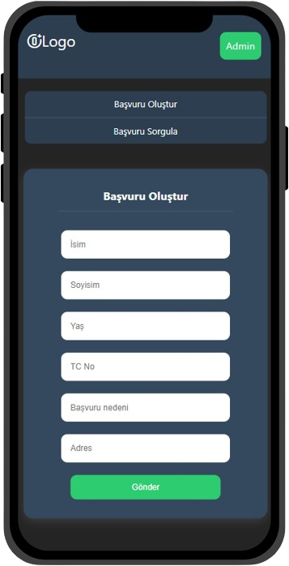
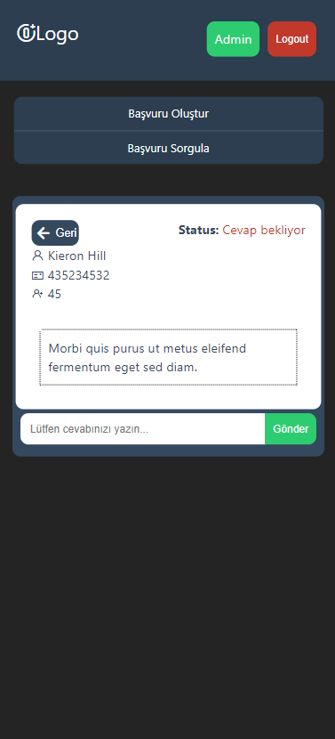

# Patika-Fimple-React-Bootcamp-Final-Case
 Safa Anıl Atasoy Patika and Fimple React Bootcamp Final Case


<a name="readme-top"></a>


<!-- PROJECT SHIELDS -->

[![LinkedIn][linkedin-shield]][linkedin-url]

<!-- PROJECT LOGO -->
<br />
<div align="center">
  <a href="#">
    
  </a>

  <h3 align="center">Patika and Fimple React Bootcamp Final Case</h3>

  <p align="center">
     Safa Anıl Atasoy Patika and Fimple React Bootcamp Final Case
    <br />
    <br />
    <a href="#">Live Demo</a>
  </p>
</div>

<!-- TABLE OF CONTENTS -->
<details>
  <summary>İçindekiler Tablosu</summary>
  <ol>
    <li>
      <a href="#about-the-project">Proje Hakkında</a>
      <ul>
        <li><a href="#built-with">Geliştirme Araçları</a></li>
      </ul>
    </li>
    <li>
      <a href="#getting-started">Projeyi Ayağa Kaldırmak</a>
      <ul>
        <li><a href="#prerequisites">Önkoşullar</a></li>
        <li><a href="#installation">Kurulum</a></li>
      </ul>
    </li>
    <li><a href="#usage">Kullanım</a></li>
    <li><a href="#roadmap">Yol Haritası</a></li>
    <li><a href="#contributing">Katkı</a></li>
    <li><a href="#license">Lisans</a></li>
    <li><a href="#contact">İletişim</a></li>
    <li><a href="#acknowledgments">Teşekkür</a></li>
  </ol>
</details>

<!-- ABOUT THE PROJECT -->
## Proje Hakkında

 


Uygulamamız, herkese açık bir başvuru formuyla başlıyor. Kullanıcılar, bu formu doldurduktan sonra başvurularını takip edebilmek için benzersiz bir kod alırlar. Bu kod, kullanıcılara başvurularının durumunu kontrol etme imkanı tanır. Kullanıcılar, başvuru durumu sayfasından bu kod ile başvurularını çözülüp çözülmediğini kolayca kontrol edebilirler.

### Uygulama Senaryosu

Yetkili kullanıcılar ise kullanıcı adı ve şifre ile giriş yapabilecekleri bir ekran üzerinden gelen başvuruları görüntüleyebilirler. Cevaplanmamış başvurulara cevap yazabilir ve başvurunun durumunu güncelleyebilirler. Başvurunun çözüldüğü, iptal edildiği veya hala beklediği gibi durumlar bu ekran üzerinden kolayca yönetilebilir. Ayrıca, geçmiş kayıtlara ulaşma imkanı sayesinde eski başvuruları inceleme ve raporlama yapma olanağına da sahiptirler.

Bazı özellikler:

* Kullanıcılar ana ekran üzerinden başvuru kaydı yapabilir.
* Başvuru kaydı başarılı ise kullanıcılara benzersiz bir kod verilir.
* Kullanıcılar bu kodu sorgulama sayfasındaki arama kutucuğuna girdiklerinde, başvuruları hakkındaki güncel durum hakkında bilgi sahibi olabilir.
* Yöneticiler admin paneli giriş sayfası üzerinden giriş yapabilir.
* Yöneticiler başvuru listesine erişebilir ve istedikleri başvurunun detay sayfasına erişebilir.
* Yöneticiler başvuruları silebilir, cevap yazabilir, cevaplanmış eski başvuruları ve başvuru yapılma tarihini görebilir.

Aşşağıda özellikler daha detaylı şekilde açıklanmıştır.


### Geliştirme Araçları

* [![React][React.js]][React-url]
  * [![Formik][Formik]][Formik-url]
  * [![Yup][Yup]][Yup-url]
* ![Firebase][Firebase]

<p align="right">(<a href="#readme-top">yukarıya dön</a>)</p>

<!-- GETTING STARTED -->
## Uygulamayı Ayağa Kaldırmak

Uygulamayı kendi hesabınıza klonlamak için

  ```sh
  git clone https://github.com/safaanilatasoy/Patika-Fimple-React-Bootcamp-Final-Case
  ```
  
### Kurulum


1. Firebase kurulumu için [https://firebase.com](https://firebase.com)
2. Repository klonlamak için

   ```sh
   git clone https://github.com/safaanilatasoy/Patika-Fimple-React-Bootcamp-Final-Case
   ```

3. Proje klasörüne gitmek için

  ```sh
  cd client
  ```

4. Proje için gerekli paketleri yüklemek için

  * yarn

  ```sh
  yarn
  ```

* npm

  ```sh
  npm install 
  ```

5. Firebase ayarlarınız için `src/firebase.jsx`

```js
    const firebaseConfig = {
        apiKey: "YOUR_API_KEY",
        authDomain: "YOUR_AUTH_DOMAIN",
        projectId: "YOUR_PROJECT_ID",
        storageBucket: "YOUR_STORAGE_BUCKET",
        messagingSenderId: "YOUR_SENDER_ID",
        appId: "YOUR_APP_ID",
    }

```


<p align="right">(<a href="#readme-top">yukarıya dön</a>)</p>

<!-- USAGE EXAMPLES -->
## Kullanım


<p align="right">(<a href="#readme-top">yukarıya dön</a>)</p>

<!-- ROADMAP -->
## Yol Haritası

* [x] Kullanıcılar ana ekran üzerinden başvuru kaydı yapabilir.
* [x] Başvuru kaydı başarılı ise kullanıcılara benzersiz bir kod verilir.
* [x] Kullanıcılar bu kodu sorgulama sayfasındaki arama kutucuğuna girdiklerinde, başvuruları hakkındaki güncel durum hakkında bilgi sahibi olabilir.
* [x] Yöneticiler admin paneli giriş sayfası üzerinden giriş yapabilir.
* [x] Yöneticiler başvuru listesine erişebilir ve istedikleri başvurunun detay sayfasına erişebilir.
* [x] Yöneticiler başvuruları silebilir, cevap yazabilir, cevaplanmış eski başvuruları ve başvuru yapılma tarihini görebilir.


<p align="right">(<a href="#readme-top">yukarıya dön</a>)</p>

<!-- CONTRIBUTING -->
## Katkı

Katkılar, açık kaynak topluluğunu öğrenmek, ilham vermek ve yaratmak için harika bir yer haline getiren şeydir. Yaptığınız her türlü katkı **büyük takdire şayandır**.

Bunu daha iyi hale getirecek bir öneriniz varsa lütfen repoyu forklayın ve bir pull request oluşturun. Ayrıca "geliştirme" etiketiyle de bir istek açabilirsiniz.
Projeye yıldız vermeyi unutmayın! Tekrar teşekkürler!

1. Projeyi forklayın.
2. Yeni özellik Branch'ınızı oluşturun. (`git checkout -b feature/AmazingFeature`)
3. Değişikliklerinizi commitleyin. (`git commit -m 'Add some AmazingFeature'`)
4. Branch'a pushlayın. (`git push origin feature/AmazingFeature`)
5. Pull request oluşturun.

<p align="right">(<a href="#readme-top">yukarıya dön</a>)</p>


<!-- PROJECT SCREENSHOTS -->
## Ekran Görüntüleri

### Masaüstü Ekran Görüntüleri

   
   
   
   


### Mobil Ekran Görüntüleri

    
    


<!-- CONTACT -->
## İletişim

Safa Anıl Atasoy - [Linkedin](https://www.linkedin.com/in/safaanilatasoy/) - [Github](https://github.com/safaanilatasoy) - <safaanilatasoy@gmail.com>

Projec Linki: [Github](https://github.com/safaanilatasoy/Patika-Fimple-React-Bootcamp-Final-Case)

<p align="right">(<a href="#readme-top">yukarıya dön</a>)</p>

<!-- ACKNOWLEDGMENTS -->
## Teşekkür

Öncelikle bootcamp süresince bana destek olan ve projemi incelemek için zaman harcayan herkese teşekkür ederim.


<p align="right">(<a href="#readme-top">yukarıya dön</a>)</p>

<!-- MARKDOWN LINKS & IMAGES -->

[linkedin-url]: https://www.linkedin.com/in/safaanilatasoy/
[React.js]: https://img.shields.io/badge/React-20232A?style=for-the-badge&logo=react&logoColor=61DAFB
[React-url]: https://reactjs.org/
[Formik]: https://img.shields.io/badge/Formik-blue
[Formik-url]: https://formik.org/
[Yup]: https://img.shields.io/badge/Yup-red
[Yup-url]: https://www.npmjs.com/package/yup
[ReactRouterDom]: https://img.shields.io/badge/ReactRouterDom-green
[ReactRouterDom-url]: https://reactrouter.com/en/main
[Firebase]: https://img.shields.io/badge/Firebase-yellow
[Firebase]: https://firebase.google.com/


